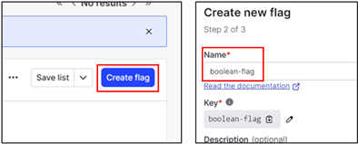

# Sample application with feature flag implemented using Launchdarkly

## 1. Supporting business requirements seamlessly with confident
This repo contains the lab we are going to work though as part of the feature flag - Bridging the gap to the business needs which update webpage content seamlessly during runtime, without deploying new code. 

For the purposes of the Hands-On, we prepared a few html and node js files and make the steps easy for the anyone.

Prerequisites
- You will need a launchdarkly account. You may sign up a trial account here: https://launchdarkly.com/start-trial/
- Installed Node JS in your machine, ideally minimum node version v20.x.x
- Installed Launchdarkly’s node-server-sdk
  - npm install @launchdarkly/node-server-sdk
- Sample application
  - Download/clone from https://github.com/TanSiHao/simpleNodeJsApp.git 

## 2. Setup feature flag
Switch to “Test” enviroment, we will create a feature flag under the enviroment.

<br />

1.	Click “Create flag”
2.	Name: Boolean-flag<br />

<br />

3.	Click “Next” 
4.	Now, you need to get the sdkKey from your LaunchDarkly. You can get it from below path.
Account settings -> Projects -> CHOOSE YOUR PROJECT -> Copy the correct environment's SDK Key and store it. You will need SDK Key for this hand-on. 

<br />

## 3.	Setup sample Node application
Paste the SDK Key copied from your Launchdarkly test environment to testconnection.js and launchDarkly.js.

Line 4, testconnection.js

<br />

Line 7, launchDarkly.js

<br />

## 4.	Test your connection to your Launchdarkly feature flag.
Run 
```sh
node testconnection.js
```
Your console will return false. 

Result:

<br />

Switch “On” your feature

<br />

Run 
```sh
node testconnection.js
```

Your console will return true.

Result:

<br />

## 5.	Run you application with feature flag “Off” and “On”.
Start the web server. Run 
```sh
node app.js.
```
<br />
Access URL on port 3000 here: http://localhost:3000/

<br />

Go back to the feature flags page. Toggle “On” the flag.

<br />

Click refresh on your browser or “F5” to refresh the web page.

<br />